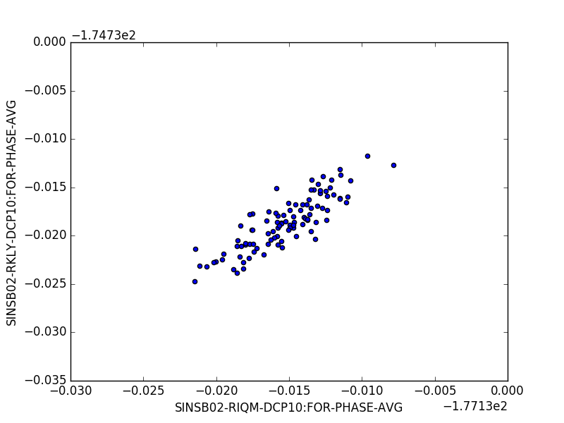
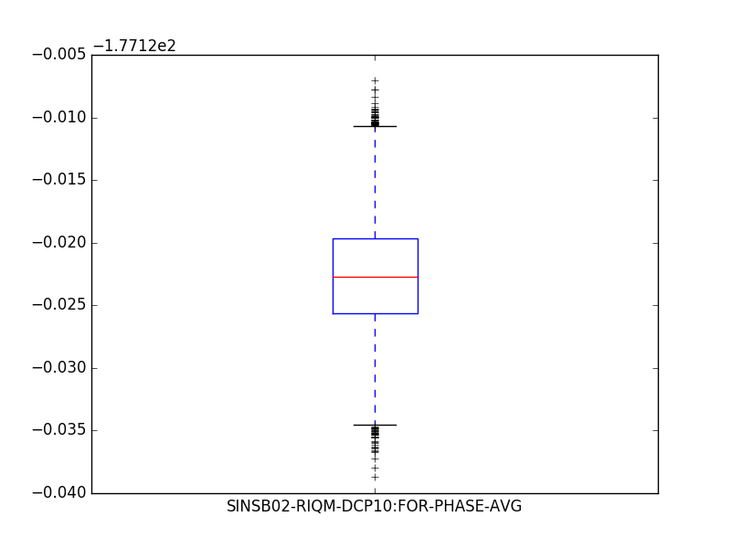

[](https://travis-ci.org/paulscherrerinstitute/data_api_python)
[](https://ci.appveyor.com/project/simongregorebner/data-api-python)

# Overview

This is the basic Python library to read data from the PSI SwissFEL DataBuffer and Epics Archiver.
The library accesses the data via the DataAPI REST service and (by default) loads it into a Pandas data frame.


>What is a Pandas DataFrame? Think about it as a big table, where all values are indexed using either the `global timestamp` or the `pulse_id`. This allows you to execute statistical operations, correlations, filtering etc in a very easy and efficient way. More about Pandas you can find here:
* http://pandas.pydata.org
* http://pandas.pydata.org/index.html
* http://pandas.pydata.org/pandas-docs/stable/10min.html


# Usage

Import library:

```python
import data_api as api
```

Search for channels:

```python
channels = api.search("SINSB02-RIQM-DCP10:FOR-PHASE")
```

The channels variable will hold something like this:
```python
[{'backend': 'sf-databuffer',
  'channels': ['SINSB02-RIQM-DCP10:FOR-PHASE',
   'SINSB02-RIQM-DCP10:FOR-PHASE-AVG']},
 {'backend': 'sf-archiverappliance',
  'channels': ['SINSB02-RIQM-DCP10:FOR-PHASE-AVG-P2P',
   'SINSB02-RIQM-DCP10:FOR-PHASE-JIT-P2P',
   'SINSB02-RIQM-DCP10:FOR-PHASE-STDEV']}]
```

Get data by global timestamp:

```python
import datetime
now = datetime.datetime.now()
end = now-datetime.timedelta(minutes=1)
start = end-datetime.timedelta(seconds=10)
data = api.get_data(channels=['SINSB02-RIQM-DCP10:FOR-PHASE'], start=start, end=end)
```

Get data by pulseId:

```python
import datetime
start_pulse_id = 123456
stop_pulse_id = 234567
data = api.get_data(channels=['SINSB02-RIQM-DCP10:FOR-PHASE'], start=start_pulse_id, end=stop_pulse_id, range_type="pulseId")
```

Show head of datatable:
```python
data.head()
```

Find all data corresponding to given index:
```python
data.loc["1468476300.047550981"]
```

Plot data:
```python
import matplotlib.pyplot as plt
data.plot.scatter("SINSB02-RIQM-DCP10:FOR-PHASE-AVG", "SINSB02-RKLY-DCP10:FOR-PHASE-AVG")
plt.show()
```



```python
import matplotlib.pyplot as plt
data[['SINSB02-RIQM-DCP10:FOR-PHASE-AVG', ]].plot.box()
plt.show()
```




Plot waveforms:
```python
plt.plot(data['SINSB02-RIQM-DCP10:FOR-PHASE']['1468476300.237551000'])
plt.show()
```


Find where you have data:
```
data[data['SINSB02-RIQM-DCP10:FOR-PHASE'].notnull()]
```

Save data:

```python
# to csv
data.to_csv("test.csv")

# to hdf5
data.to_hdf("test.h5", "/dataset")
```

## Use Server-Side Aggregation

To minimize data transfer requirements, data can be requested in an aggregated way from the API. The server than takes care of aggregating the values and only send the aggregated values to the client.

```Python
import data_api as api
import datetime
now = datetime.datetime.now()
end = now-datetime.timedelta(minutes=1)
start = end-datetime.timedelta(seconds=10)


aggregation = api.Aggregation(aggregation_type="value", aggregations=["min", "mean", "max"], extrema=None, nr_of_bins=None, duration_per_bin=None, pulses_per_bin=None) # Just set the parameters you explicitly want to set - this example is showing the defaults - for more details about the parameters and their effect see https://git.psi.ch/sf_daq/ch.psi.daq.queryrest#data-aggregation

data = data_api.get_data(channel_list, start=start, end=end, aggregation=aggregation)
```

For more details on the aggregation values and their effects see: https://git.psi.ch/sf_daq/ch.psi.daq.queryrest#data-aggregation

## Query Specific Backend
By default the data API first queries the DataBuffer for the channel, if the channel is not found there, it then does a query to the Epics Archiver.

If you want to explicitly specify which backend/system the channel should be queried from you can prepend the channel name with either *sf-databuffer/* or *sf-archiverappliance/*

```
"sf-databuffer/CHAN1"
# or
"sf-archiverappliance/CHAN1"
```

## Query For PulseId Global Timestamp Mapping

To find the correspondig global timestamp of a given pulseid this method can be used:
```python
import data_api as api

api.get_global_date(pulseid)

# Query for multiple pulseids mappings
api.get_global_date([pulseid1, pulseid2])
```

The method accepts a single or multiple pulseids and returns a list of global dates for the specified pulseids.
By default the method uses the beam ok channel (SIN-CVME-TIFGUN-EVR0:BEAMOK)
to do the mapping. If the mapping cannot be done the method raises an ValueException.
In that case a different mapping channel via the functions optional parameter `mapping_channel` can be specified

# Command Line Interface
The packages functionality is also provided by a command line tool. On the command line data can be retrieved as follow:

```
$ data_api -h
usage: data_api [-h] [--regex REGEX] [--from_time FROM_TIME]
                [--to_time TO_TIME] [--from_pulse FROM_PULSE]
                [--to_pulse TO_PULSE] [--channels CHANNELS]
                [--filename FILENAME] [--overwrite] [--split SPLIT] [--print]
                [--binary]
                action

Command line interface for the Data API

positional arguments:
  action                Action to be performed. Possibilities: search, save

optional arguments:
  -h, --help            show this help message and exit
  --regex REGEX         String to be searched
  --from_time FROM_TIME
                        Start time for the data query
  --to_time TO_TIME     End time for the data query
  --from_pulse FROM_PULSE
                        Start pulseId for the data query
  --to_pulse TO_PULSE   End pulseId for the data query
  --channels CHANNELS   Channels to be queried, comma-separated list
  --filename FILENAME   Name of the output file
  --overwrite           Overwrite the output file
  --split SPLIT         Number of pulses or duration (ISO8601) per file
  --print               Prints out the downloaded data. Output can be cut.
  --binary              Download as binary
```

To export data to a hdf5 file the command line tool can be used as follows:

```bash
data_api --from_time "2017-10-30 10:59:45.788" --to_time "2017-10-30 11:00:45.788" --channels S10CB01-RLOD100-PUP10:SIG-AMPLT-AVG --filename testit.h5  save
```

__To improve download speeds use the `--binary` option for saving data into a hdf5 file.__ 

As downloads might be pretty big and if you are not using the `--binary` option the current implementation need to keep all data in memory before writing you have to use the `--split` option to split up the data files. 
When having this option specified the query will be split in several smaller queries.

In case of an pulse based query this argument takes an integer, in case of a time based query it takes an [ISO8601](https://en.wikipedia.org/wiki/ISO_8601#Durations) duration string. 
Please note that in the case of duration year and month durations are not supported!

Pulse based query:
```bash
data_api --from_pulse 5166875100 --to_pulse 5166876100 --channels sf-databuffer/SINEG01-RCIR-PUP10:SIG-AMPLT --split 500 --filename testit.h5 save
``` 

Time based query:
```bash
data_api --from_time "2018-04-05 09:00:00.000" --to_time "2018-04-05 10:00:00.000" --channels sf-databuffer/SINEG01-RCIR-PUP10:SIG-AMPLT --split PT30M --filename testit.h5 save
```

Example durations:
* *PT2M* - 2 minutes
* *PT1H2M* - 1 hour and 2 minutes
* *PT10S* - 10 seconds
* *P1W* - 1 week
* *P1DT6H* - one day and 6 hours

# Examples

## Jupyter Notebook
If you want to run our Jupyter Notebook examples, please clone this repository locally, then:
```
cd examples
ipython notebook
```

# Installation

You can install through our Anaconda repository:

```
conda install -c paulscherrerinstitute data_api
```
